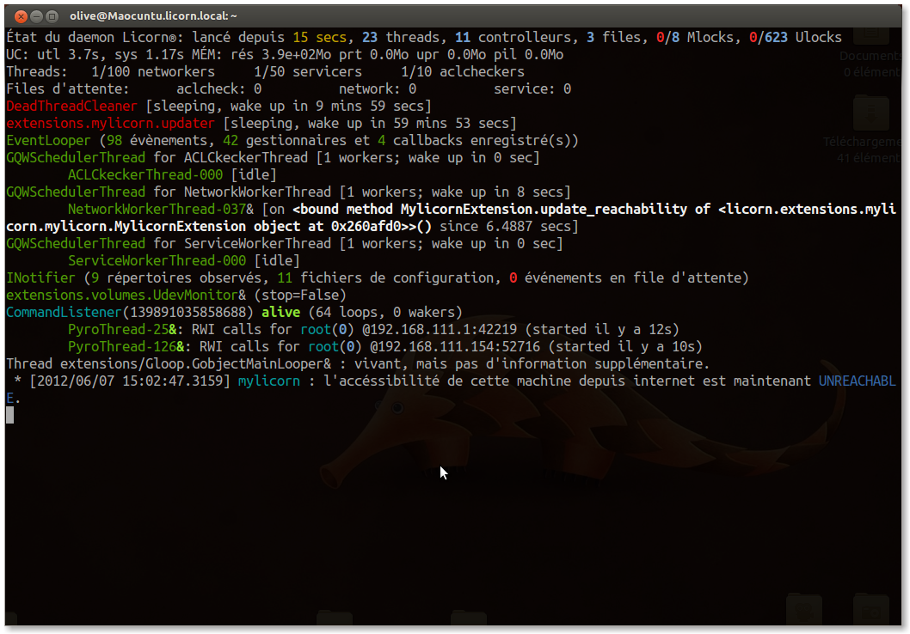

.. _daemon.en:

.. highlight:: bash

==================
The Licorn® daemon
==================

:program:`licornd` handles all the dirty job for us — I thank it for that. It manages the system, users, groups and all other valuable objects. It updates :file:`/etc/*`, monitors shared group dirs and automatically checks and enforces files permissions and `POSIX.1e` :abbr:`ACL (Access Control Lists)`\s on files and directories, so you never have to handle them manually (in case of any problem, :ref:`chk <chk.en>` is your friend).

It also **starts the WMI**, and run the automatic incremental-backup via threads, provides a :ref:`top-like information interface <daemon_toplike_interface>`, and even a built-in remote :ref:`fully interactive shell <daemon_interactive_shell>` if you need to gather specific informations or just want to be curious about its internals.

Behinds this seems-quite-huge presentation, you will find a big-balled but very administrator-friendly program.

Daemon status
=============

At any moment you could want informations about the running daemon::

	get status

Which brings this kind of output on my machine (in french):

Start and auto-start
====================

**In standard conditions, the daemon start and stop process is completely automatic**: it is managed by your GNU/Linux distribution startup scripts. For example on Debian & Ubuntu, :program:`licornd` is started at boot and stopped on reboot or halt, without any further human intervention. You can start / stop / restart it by using the :command:`service` system command (refer to your distro documentation for more details).

Though, you could want to know how to handle it yourself, because you can completely interfere with the system service handlers without any trouble.

Provided that you are registered as a Licorn® administrator (member of group ``admins`` on the current machine or on the network on LDAP enabled systems), **any attempt to use CLI tools will automatically launch the daemon** in the background, if it is not already running. **The daemon takes less than a second to be fully operationnal** and answers to the CLI command you initialy launched.

If for any reason you need to start it by hand, just do it the simple way::

	licornd

If you want it to stay on your terminal and display nice information messages::

	licornd --verbose --no-daemon

	# the short way:
	licornd -vD

Given there is already another daemon running and you want to replace it with another one::

	licornd --replace

	# the command i use often during debug phases to retake
	# control over a daemon already forked in the background:
	licornd -rvD

Note that using the :option:`--replace` flag won't hurt if there's no daemon running: the program will just continue as if you didn't provided it.

Files and configuration
=======================

    * its log: :file:`/var/log/licornd.log`
    * the configuration file is :file:`/etc/licorn/main.conf` in which all directives starting with ``licornd.`` are used by the daemon.

Interactive sessions
====================

For some reason, you will want or need to interact directly with the daemon (Actually, this can be fun!). Just start it with a special argument :option:`-D` (long option :option:`--no-daemon`)::

	licornd -D
	# or:
	licornd -vD
	# and so on with -vvD and -vvvD

The daemon then stays attached to your terminal. You now have the **top-like interface** available to you.

.. _daemon_toplike_interface:

Top-like interface
------------------

If your daemon is not locally connected to you console, you can invoke the top-like interface remotely::

	get sta -m

	# the long story; --monitor is mandatory if you want to keep the connection
	# open and interact with the daemon.
	get status --monitor

These keyboard short commands are available:

.. glossary::

	:kbd:`Space`
		Will display the current status of the daemon, its threads and controller instances. The status can be very verbose or not, depending on the full status flag (see below). Typing repeatedly on kbd:`Space` will emulate a top-like behaviour, allowing to monitor the daemon status in real-time, even if it is very busy.

	:kbd:`Control-t`
		Will do exactly the same as :kbd:`Space`. It's a standard behaviour in shells of BSD systems, and I missed it a lot under `GNU/Linux`.

	:kbd:`Control-y`
		Will do exactly the same as :kbd:`Space`, but will clear the screen first.

	:kbd:`f` or :kbd:`l`
		Will toggle between normal and full status. The status flag is remembered until the daemon terminates or restarts.

	:kbd:`Control-r`
		Will restart the daemon (by sending it an ``USR1`` signal). Very useful when you modified any configuration directive or source code.

	:kbd:`Control-c`
		Will break and terminate, as expected.

	:kbd:`Control-u`
		Will terminate the daemon with a traditionnal ``TERM`` signal (15), simulating a normal :command:`kill` or :command:`killall`.

	:kbd:`Control-k`
		**Extreme caution**: will send a real ``KILL`` signal (9). Use this when you think the daemon is stuck and doesn't respond anymore (this can happen when it blocks on DNS timeout, it seems totally unresponsive, but is not).

	:kbd:`Enter`
		Will just display a newline (usefull for manually marking spaces between different operations).

	:kbd:`Control-L`
		Will clear the screen, like in a normal terminal.

	:kbd:`i`
		Will enter the interactive shell (see below). Press :kbd:`Control-d` or type `exit` to leave the shell.

.. _daemon_interactive_shell:

Interactive shell
-----------------

.. warning:: Using this feature can be dangerous in some conditions. Remember that your daemon runs as ``root`` on your system. Don't try anything fancy here!

The daemon's interactive shell is an enhanced python shell. Its major features are:

* a powerfull completion system (with the traditionnal :kbd:`Tab` key)
* an full command history, remembered across interactive sessions (even if the daemon stops or restarts); history file is located at :file:`~/.licorn/licornd_history`.
* the Licorn runtime environment: you are **inside** the daemon, which keeps running while you type. You can act on threads, send messages, fill `queues` with manually-crafted data to see how the system reacts, import modules to test them, and more.
* 2 helper functions: :func:`~foundations.ltrace.dump` and :func:`~foundations.ltrace.fulldump`, to introspect nearly any Licorn® object.

If your daemon is not locally connected to your console, you can invoke the interactive shell::

	get in

	# the long story
	get inside

Other daemon's arguments
========================

Please refer to integrated help for an exhaustive listing of the daemon's CLI arguments, they are documented online::

	licornd --help

.. seealso::
	* :ref:`The daemon developer documentation <daemon.dev.en>`.
	* :ref:`The service facility <daemon.services.en>`.
