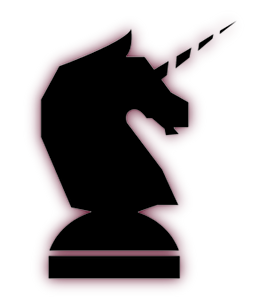

:orphan:

.. comment for special characters …
   ← ↑ → ↓ ↖ ↗ ↘ ↙ ↝ ↣ ↤ ↥ ↧ ↩ ↪ ↫ ↬
   ↯ ↰ ↱ ↲ ↳ ↴ ↵ ↶ ↷
   ↹ ↺ ↻ ⇄ ⇅ ⇵ ⇆ ⇇ ⇈ ⇉ ⇊
   ⇐ ⇑ ⇒ ⇓ ⇔ ⇕ ⇖ ⇗ ⇘ ⇙ ⇠ ⇡ ⇢ ⇣ ⇤ ⇥
   ⇱ ⇲ ∃ ∄ ∀ ∈ ∉ ∋ ∌ ∊ ∍
   ∝ ∞ … † ‰ ‱ ℡ ™ ℻ ⍺ ⎗ ⎘ ⎙ ⎚ ⟲ ⟳
   ⌨ ⌫ ⌘ ⌃ ⌤ ⌥ ⏏ ⏎ ⎆ ⎇ ⇪ ⇧
       
   ㎐㎑㎒㎓㎔㎅㎆㎇
   quotation hiphen —
   non-breaking space " "  
   ⌨ ⌾ ⌬ ⎆ ⎇ ⎈ ⎊ ⎋ ⎌ ★ ☆ ☠ ☢ ☣ ☤ ⚒
   ⚓ ⚔ ⚕ ⚐ ⚑ ⚖ ⚘ ⚙ ⚚ ⚛ ⚠ ✎ ✏ ✐ ✑ ✒ ✍
   ✓ ✔ ✕ ✖ ✗ ✘ ✇ ⧎ ⧓
   ✩ ✪ ✫ ✬ ✭ ✮ ✯ ✰ ✱ ✲ ✳ ✴ ✵ ✶ ✷ ✸ ✹ ✺
   ✻ ✿ ❀ ❁ ❂ ❃ ❄ ❅ ❆ ❇ ❈ ❊ ❋
   ➔ ➘ ➙ ➚ ➛ ➜ ➝ ➞ ➟ ➠ ➡ ➢ ➣ ➤ ➾
   ′ ″ ‴ ‵ ‶ ‷ “ ” „ ‟ ‘ ’ ‚ ‛
.. Licorn® documentation master file, created by
   sphinx-quickstart on Tue Nov 23 22:29:46 2010.
   You can adapt this file completely to your liking, but it should at least
   contain the root `toctree` directive.

=====================
Documentation Licorn®
=====================

Licorn® est un ensemble de programme conçus pour les administrateurs GNU/Linux et Un*x, pour les aider à traiter leurs tâches quotidiennes (gestion des comptes utilisateurs, des groups, des sauvegardes, imprimantes, partages, etc) de la manière la plus efficace possible.

N'avez-vous jamais rencontré cette situation: «Arrête de m'embetter, sale programme, fais juste ce que je veux, et simplement, veux-tu ?». Nous l'avons vécu (subie ?) plus d'une fois, et Licorn® est notre réponse à la partie «gestion du système» de l'histoire.

Licorn® est conçu par des administrateurs GNU/Linux et \*BSD de longue date. Il est implémenté selon des méthodes agiles en `Python <http://www.python.org/>`_, avec comme maître-mots la flexibilité et l'extensibilité.

Pour commencer, je vous suggère de lire la :ref:`procédure d'installation <install.fr>`, et vous serez prêt à :ref:`plonger dans le «Démarrage rapide» <userdoc/quickstart.fr>` et apprécier les pouvoirs de l'animal mystique que nous avons créé. Attachez votre clavier.

Et tant que nous y sommes, n'hésitez pas à `nous contacter <mailto:dev@licorn.org>`_ pour nous faire un retour ou nous poser des questions, on adore ça (surtout Robin !).

.. note:: la doc en français est en cours de rédaction, car je produis essentiellement en anglais et n'ai pas le temps de tout traduire. `Vous êtes les bienvenus si vous voulez participer <mailto:dev@licorn.org>`_ à la traduction.

Utiliser Licorn®
================

.. toctree::
	:maxdepth: 2

	features.fr
	install.fr
	userdoc/index.fr

Développer pour ou avec Licorn®
===============================

.. toctree::
	:maxdepth: 2

	concepts.fr
	api.fr
	specs/index.fr

Index et tables
===============

* :ref:`genindex`
* :ref:`search`

