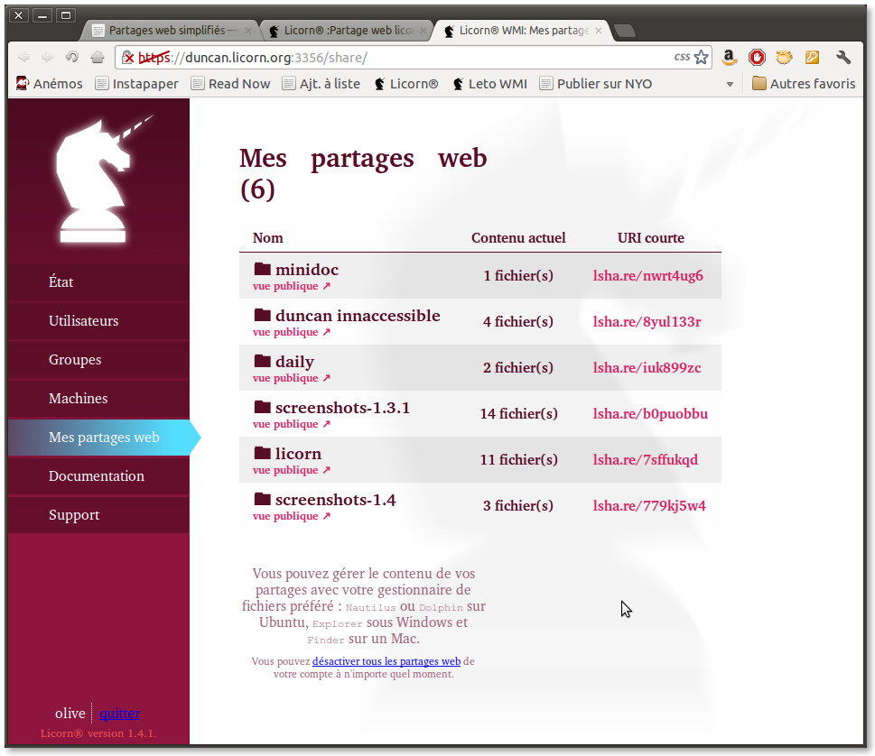

.. _simplesharing.fr:

.. highlight:: bash

=======================
Partages web simplifiés
=======================

Avec votre serveur Licorn®, vous pouvez partager des fichiers avec des personnes extérieures très simplement :

* dans votre :ref:`répertoire personnel <homedir.fr>`, vous trouverez un dossier nommé ``Public``. S'il n'y est pas, créez-le. Attention : c'est « *Public* » avec un « P » majuscule.
* dans ce dossier ``Public``, tout répertoire que vous créerez devient automatiquement un partage ! Créez-en donc autant que vous le souhaitez et déposez dedans ce qui vous plait (documents, images…).

Voici un exemple de partage tel qu'il est vu par un visiteur extérieur :

Adresse de partage
~~~~~~~~~~~~~~~~~~

Vous trouverez la liste de vos partages actifs dans votre `WMI <https://licorn:3356/share/>`_. Dans cette liste, des liens vers les « vues publiques » de vos partages vous permettent de les voir comme les verront vos partenaires. 

.. Note::
	Pour chaque partage, **le lien à transmettre est donc l'adresse de sa vue publique**.

Les partages sont accessibles depuis l'extérieur (comme un extranet public), il vous suffit de connaître l'adresse internet de votre serveur. L'adresse générique est :

	https://SERVEUR:3356/share/UTILISATEUR/PARTAGE

* ``SERVEUR`` : celà dépend de la configuration de votre réseau ; demandez à votre gestionnaire / administrateur.
* ``UTILISATEUR`` : c'est votre identifiant de connexion Licorn®.
* ``PARTAGE`` : le nom de votre partage, tel que vous l'avez créé. Celui-ci est cependant « encodé pour internet », ce qui signifie que si le nom de votre dossier contient des accents, des espaces ou des caractères spéciaux, le plus simple est de copier-coller le lien depuis la `liste dans votre WMI <https://licorn:3356/share/>`_.

Notes pour les gestionnaires / administrateurs
----------------------------------------------

Pré-requis
~~~~~~~~~~

Les partages web simplifiés nécessitent que votre serveur Licorn® soit accessible depuis l'extérieur. Pour celà :

* votre routeur doit translater le port ``3356`` de l'extérieur du réseau vers le serveur Licorn®.
* vous devez connaître le nom ou l'adresse IP de votre serveur.
* posséder un nom de domaine est un vrai plus, car vos utilisateurs pourront le donner comme adresse de partage.

Disponibilité
~~~~~~~~~~~~~

 * les partages web simplifiés sont disponibles et activés automatiqement dans les versions 1.4 et supérieures. 
 * dans les version 1.3.x, c'est une :ref:`fonctionnalité expérimentale <settings.experimental.enabled.fr>` qu'il vous faut activer manuellement.
 * non-disponible avant la version 1.3.

