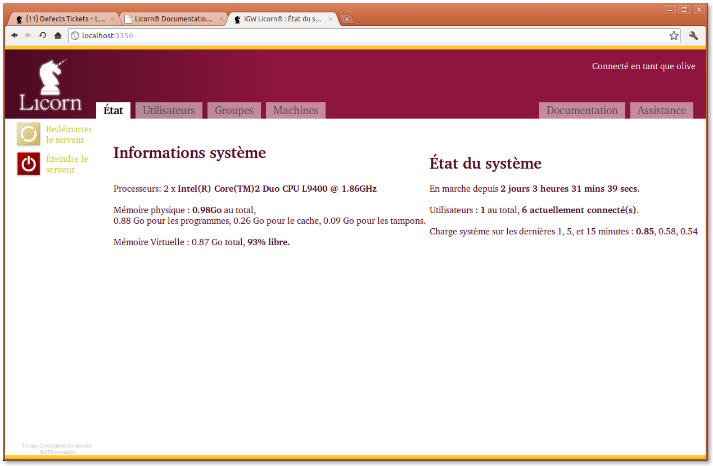

.. _wmi.en:

======================================
Licorn® WMI (Web Management Interface)
======================================

Accessing the WMI is quite simple, just head your web browser to `http://localhost:3356/ <http://localhost:3356/>`_ or wherever you configured the WMI to listen to.

